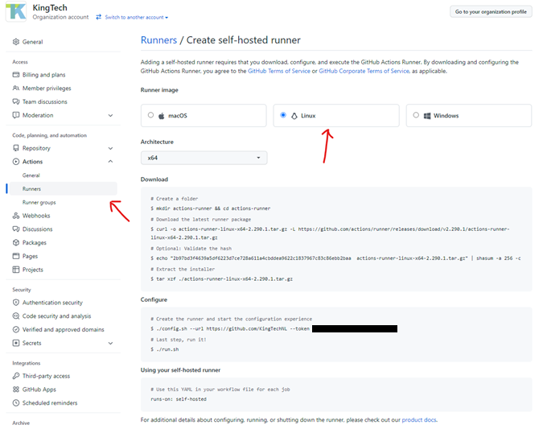

# GitHub Runners

GitHub runners are similar to the "agents" in Azure DevOps. GitHub offers 2000 minutes of free use of their own runners. If this is not enough, we have 2 options: 
-	Pay GitHub for more runner time
-	Host our own GitHub runner

As we have our own KingTech server, we can host our own runners basically for free. This chapter explains how to setup a self-hosted GitHub runner.

# Installation

In order to install a GitHub runner we first need a (virtual) machine to run it on. We chose to use a CentOS VM as this is a very lightweight operating system, but mac and windows are also fine.

First, go to the settings of your GitHub repository or organization on GitHub.com.
Under Actions, select the Runners option.



Next, we select the OS we want to install our runner on. In our case this is Linux.

Now we execute the commands shown on our runner. If using a Root account (not recommended), we first need to execute the following command:

```bash
export RUNNER_ALLOW_RUNASROOT="1"
```

For our linux build, the commands we need to run are as follows (replace `YOUR_URL` and `YOUR_TOKEN` with the token you find in the GitHub site):

```bash
mkdir actions-runner && cd actions-runner
curl -o actions-runner-linux-x64-2.290.1.tar.gz -L https://github.com/actions/runner/releases/download/v2.290.1/actions-runner-linux-x64-2.290.1.tar.gz
tar xzf ./actions-runner-linux-x64-2.290.1.tar.gz
./config.sh --url <YOUR_URL> --token <YOUR_TOKEN>
```

Next, we can either run our runner as a console application, or install it as a service.
The service doesn’t seem to work on CentOS, but the steps to install it are as follows:

```bash
sudo ./svc.sh install [USERNAME]   #username is optional
sudo ./svc.sh start
sudo ./svc.sh status
sudo ./svc.sh stop #unless you want to keep it running ofcourse
```

If the server needs to be uninstalled at some point, this can be done using the following command:

```bash
sudo ./svc.sh uninstall
```

Running as a console application (in screen) is done using the following command:

```bash
screen -dmS githubactionrunner ./run.sh
screen -ls
```
